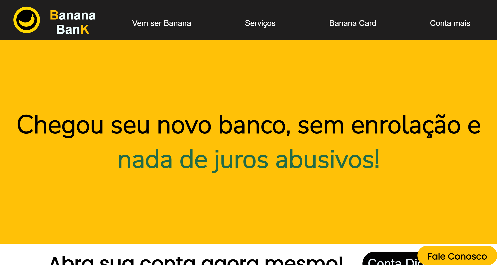

# Banana Bank 

Projeto pessoal desenvolvido para treinamento.
Realizado - 09/2022. 

[🔗 Clique aqui para acessar] (https://michel-maia.github.io/Projeto-Banana-Bank/)

## 💻 Tecnologias

As seguintes ferramentas foram usadas na construção do projeto:

- HTML
- CSS
- JavaScript

## 💬 Assuntos abordados

- HTML
    - Estruturação da página 
    - Semântica
    - 

- CSS
    - 
    - 

- Javascript
    - 
    - 

--------------------------------

> Autor: Michel Maia 

----------------------------------------

## License

[MIT](https://choosealicense.com/licenses/mit/)

## Ref

https://www.w3.org/Style/Examples/007/center.pt_BR.html

https://developer.mozilla.org/pt-BR/docs/Web/CSS